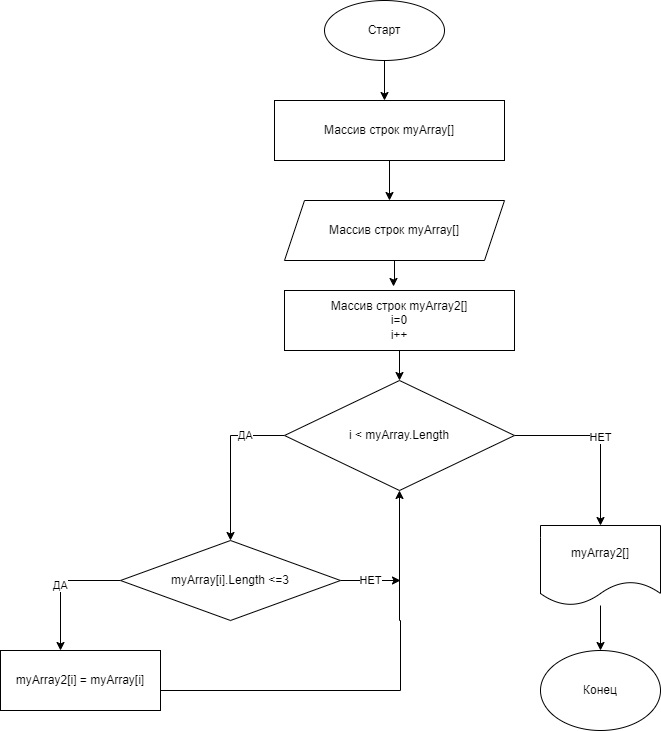

*Итоговая задача: Написать программу, которая из имеющегося массива строк, формирует массив из строк, длинна которыхменьше или ровна трём символам.*

1. Создать массив из строк.
2. Вывести в терминал.
3. Создать новый массив из строк и заполнить его элементами ранее созданного массива длинна которых меньше или ровна 3 символам.
4. Вывести новый массив в терминал.

